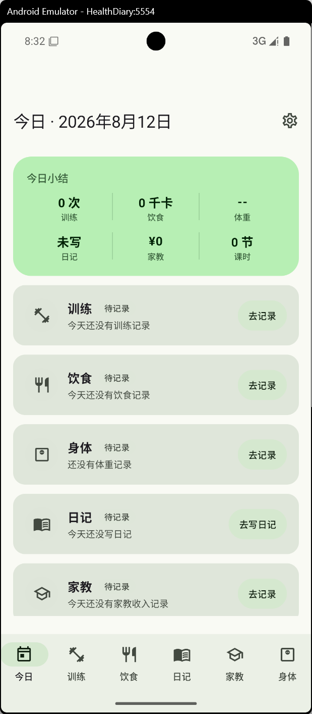
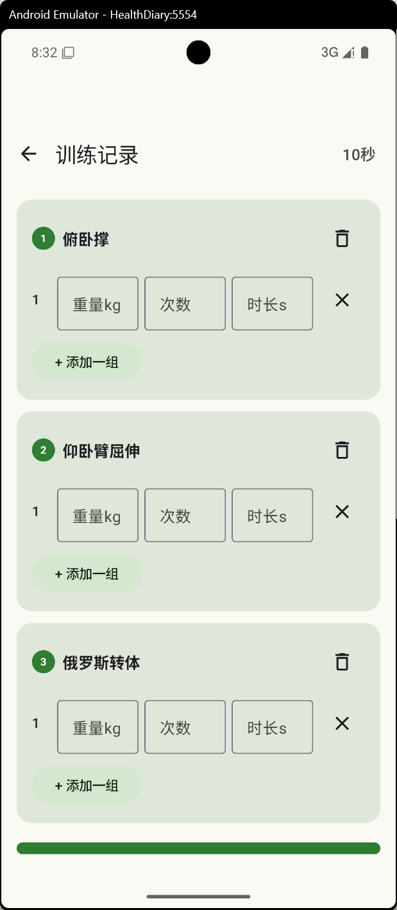
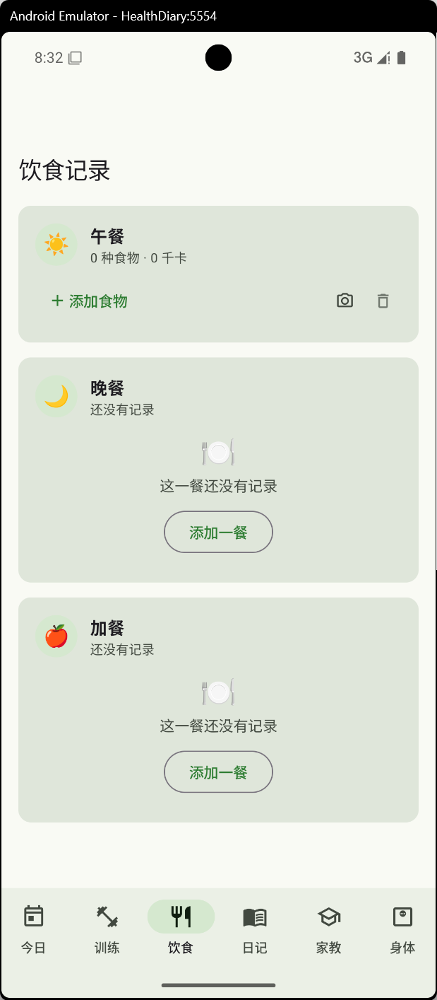
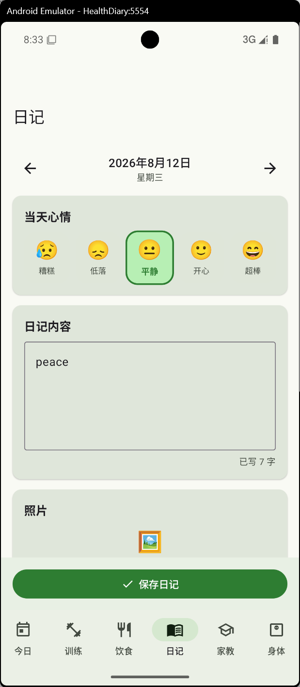
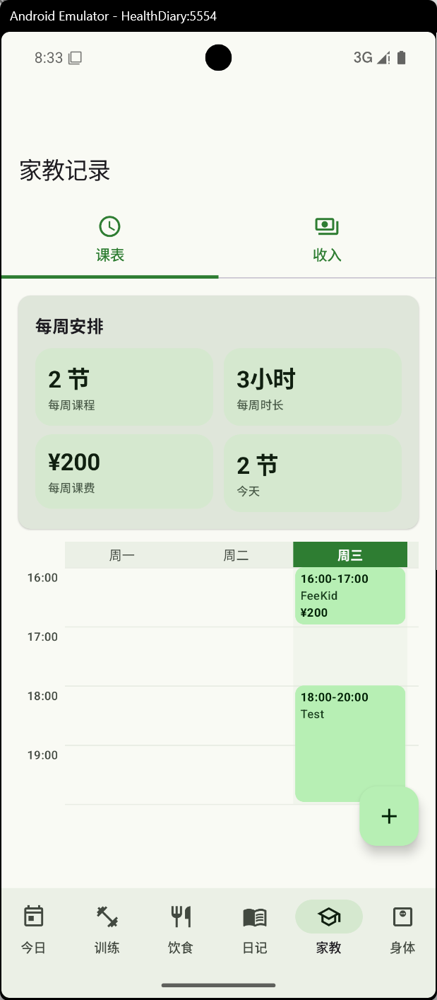
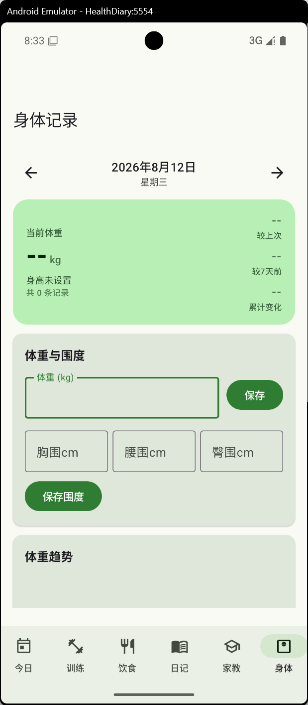

# 闲记 · Health Diary

> 一个简洁、私密、本地优先的 Android 个人生活记录应用。

**闲记**是一个面向个人使用的 Android 记录应用，用于将训练、饮食、身体变化、日记、心情以及家教安排等日常信息集中管理。

项目希望解决的不是“记录更多”，而是让不同类型的个人记录能够在一个 App 中长期、连续地保存下来。

目前项目仍处于持续开发阶段。
## 📱 应用预览

<p align="center">
  
  &nbsp;
  
  &nbsp;
  
</p>

<p align="center">
  
  &nbsp;
  
  &nbsp;
  
</p>

<p align="center">
  <sub>训练 · 饮食 · 身体 · 日记 · 家教 · 日常记录</sub>
</p>

---

---

## ✨ 功能

### 🏋️ 训练记录

记录每一次训练过程，包括：

* 训练日期与时间
* 训练动作
* 组数
* 重量
* 次数
* 训练时长
* 组间休息
* RPE
* 动作备注
* 自定义训练动作

同时可以对训练数据进行统计，包括：

* 总训练次数
* 总组数
* 总次数
* 总训练容量
* 训练时长
* 动作数量

---

### 🍚 饮食记录

记录每日饮食情况：

* 早餐
* 午餐
* 晚餐
* 加餐
* 食物名称
* 食物重量
* 热量
* 蛋白质
* 碳水化合物
* 脂肪
* 饮食照片

应用内置基础食物库，并支持按照食物重量计算营养摄入。

---

### ⚖️ 身体记录

用于长期记录身体变化：

* 体重
* 胸围
* 腰围
* 臀围
* 日期记录
* 身体照片

身体照片可以按照：

* 正面
* 侧面
* 背面

进行分类，方便观察长期训练与体型变化。

---

### 📖 日记与心情

记录每天的生活状态：

* 日记正文
* 心情
* 心情评分
* 图片
* 语音
* 创建时间
* 修改时间

相比单纯的文字日记，希望通过文字、图片、语音和心情状态共同保留每天的生活片段。

---

### 👨‍🏫 家教记录

针对个人家教工作的记录模块。

#### 课程记录

可以记录：

* 学生
* 科目
* 日期
* 开始时间
* 上课时长
* 收入
* 备注

#### 每周课程表

可以维护固定家教安排：

* 星期
* 上课时间
* 下课时间
* 学生
* 科目
* 每节课费用
* 备注

用于同时管理家教时间安排和收入记录。

---

### 🗓️ 今日

“今日”页面用于汇总当天需要关注的内容，让不同模块不再彼此独立。

后续计划进一步将：

* 今日训练
* 今日饮食
* 今日课程
* 身体记录
* 日记
* 每日提醒

整合为统一的日视图。

---

### 🔔 每日提醒

应用支持 Android 通知提醒。

目前主要用于提醒：

* 称重
* 记录训练
* 写日记

提醒任务基于 Android WorkManager 实现。

---

## 🔒 隐私设计

闲记主要面向个人记录，因此隐私是项目设计的重要原则。

当前版本：

* 不需要注册账号
* 不包含登录系统
* 不依赖自建服务器
* 核心结构化数据保存在本地数据库
* 用户设置保存在本地
* 当前应用未申请 Android `INTERNET` 网络权限
* 照片、语音等媒体文件由应用本地管理

> 注意：当前项目仍启用了 Android 系统备份能力，因此系统是否备份部分应用数据取决于 Android 版本、设备设置以及系统备份规则。

如果需要严格的“仅设备本地存储”，建议进一步关闭系统云备份或对敏感备份数据进行加密处理。

---

## 🛠️ 技术栈

| 技术                       | 用途         |
| ------------------------ | ---------- |
| Kotlin                   | 主要开发语言     |
| Jetpack Compose          | UI         |
| Material 3               | 界面组件与设计体系  |
| Navigation Compose       | 页面导航       |
| Room                     | 本地结构化数据库   |
| DataStore Preferences    | 应用设置       |
| WorkManager              | 后台提醒任务     |
| Coil                     | 图片加载       |
| ViewModel                | UI 状态管理    |
| Kotlin Coroutines / Flow | 异步任务与响应式数据 |
| KSP                      | Room 等代码生成 |

---

## 📱 开发环境

当前项目配置：

| 项目                    | 版本                    |
| --------------------- | --------------------- |
| Application ID        | `com.healthdiary.app` |
| Version               | `0.1.0`               |
| Min SDK               | 26                    |
| Target SDK            | 35                    |
| Compile SDK           | 35                    |
| Java                  | 17                    |
| Kotlin                | 2.0.21                |
| Android Gradle Plugin | 8.7.3                 |

最低 Android 版本：

```text
Android 8.0 Oreo
API Level 26
```

---

## 📂 项目结构

```text
health-diary
│
├── app
│   └── src/main
│       ├── java/com/healthdiary/app
│       │   │
│       │   ├── data
│       │   │   ├── local
│       │   │   │   ├── AppDatabase.kt
│       │   │   │   ├── Daos.kt
│       │   │   │   ├── Entities.kt
│       │   │   │   └── SeedData.kt
│       │   │   │
│       │   │   ├── media
│       │   │   ├── reminder
│       │   │   ├── repository
│       │   │   └── settings
│       │   │
│       │   ├── ui
│       │   │   ├── components
│       │   │   ├── navigation
│       │   │   ├── theme
│       │   │   └── screens
│       │   │       ├── body
│       │   │       ├── diary
│       │   │       ├── diet
│       │   │       ├── settings
│       │   │       ├── today
│       │   │       ├── tutor
│       │   │       └── workout
│       │   │
│       │   ├── util
│       │   ├── HealthDiaryApp.kt
│       │   └── MainActivity.kt
│       │
│       └── res
│
├── docs
├── gradle
├── scripts
├── build.gradle.kts
├── settings.gradle.kts
└── README.md
```

---

## 🗄️ 数据结构

当前 Room 数据库主要包含以下几类数据。

### Workout

```text
WorkoutSession
    └── WorkoutExercise
            └── WorkoutSet
```

以及独立的：

```text
ExerciseLibrary
```

---

### Diet

```text
MealRecord
    └── FoodEntry
```

以及：

```text
FoodLibrary
```

---

### Body

```text
BodyMetric
    ├── Weight
    ├── Chest
    ├── Waist
    └── Hip

BodyPhoto
```

---

### Diary

```text
DiaryEntry
    └── DiaryMedia
        ├── Photo
        └── Audio
```

---

### Tutor

```text
TutorIncomeRecord
TutorSchedule
```

---

## 🚀 构建项目

### 1. 克隆项目

```bash
git clone https://github.com/QWBO111/health-diary.git
cd health-diary
```

---

### 2. 使用 Android Studio

推荐使用较新的 Android Studio。

打开：

```text
File
→ Open
→ health-diary
```

等待 Gradle Sync 完成。

确保已经安装：

```text
Android SDK 35
JDK 17
```

---

### 3. 命令行构建

#### Windows

```powershell
.\gradlew.bat assembleDebug
```

#### Linux / macOS

```bash
./gradlew assembleDebug
```

构建完成后 APK 通常位于：

```text
app/build/outputs/apk/debug/app-debug.apk
```

---

### 4. 安装到 Android 设备

连接已经打开 USB 调试的 Android 手机后，可以执行：

```bash
adb install -r app/build/outputs/apk/debug/app-debug.apk
```

也可以直接通过 Android Studio：

```text
Run ▶
```

安装并启动应用。

---


## 🤝 Contributing

这是一个以个人需求为起点的项目，但欢迎：

* 提交 Bug
* 提出功能建议
* 改善 UI / UX
* 优化代码结构
* 补充测试
* 完善文档


---

## ⚠️ Disclaimer

闲记是一个个人生活记录工具。

其中涉及的：

* 饮食数据
* 热量数据
* 身体指标
* 训练数据

仅用于个人记录与参考，不构成医学、营养学或专业训练建议。

---

## 📄 License

当前项目尚未指定正式的开源许可证。

如果计划允许其他人自由使用、修改或分发代码，建议后续根据项目需求添加明确的开源许可证，例如 MIT、Apache-2.0 等。

---

## ❤️ About

**闲记**

记录训练，也记录生活。

希望随着时间推移，这个项目最终能够成为一本真正属于自己的数字生活手册。
